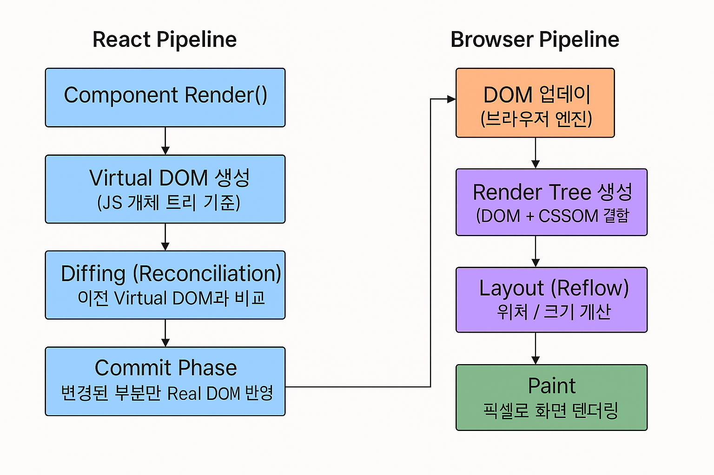

### Render Phase (가상 DOM 비교 단계)

- React가 컴포넌트의 `상태(state)`나 `props`가 변경되면,
  전체 컴포넌트를 다시 렌더 함수(render function) 를 통해 `Virtual DOM (가상 DOM 트리)`을 생성. (`V-Dom은 실제 돔이 아니라 자바스크립트 객체`)
- 이때 이전 렌더에서 만든 Virtual DOM과 현재 새롭게 생성된 Virtual DOM을 비교(diffing)
  → `Reconciliation` 과정
- React는 이 비교를 통해 **어떤 부분이 실제로 바뀌었는지(변경된 노드만)** 파악

### Commit Phase (실제 DOM 반영 단계)

- Render Phase에서 “무엇이 바뀌었는가”를 알아냈으면
  Commit Phase에서는 **그 바뀐 부분만 실제 DOM에 반영**.
- 이때 브라우저에서 발생하는 과정:
  - **Reflow (레이아웃 재계산)**
  - **Repaint (화면 다시 그리기)**
- React는 전체 DOM을 다시 만드는 게 아니라

  **변경된 노드만 교체 / 수정**하기 때문에 효율적

- React Fiber(React 16+) 덕분에 Render Phase는 **비동기적이며 중단 가능한** 작업이 되었음
  Commit Phase는 **동기적**으로 처리
- “렌더링 준비는 천천히(비동기), 실제 DOM 업데이트는 빠르게(동기)”

**정리하면:**

> React는 Render Phase에서 Virtual DOM을 이용해 변경점을 계산하고
>
> Commit Phase에서 오직 변경된 부분만 실제 DOM에 반영
>
> 전체 DOM을 교체하지 않는 이유는 Reflow/Repaint 비용 최소화

### 궁금했던 점 Swift Struct과 Value vs. Reference Type Memory

- React의 Virtual DOM 노드는 JS 객체로 표현되기 때문에

- 각 노드가 메모리 상 Heap 영역에 흩어져 존재하고, 포인터(참조)를 따라가며 비교(diffing)해야함
- **CPU 캐시 친화적이지 않고, GC pressure(가비지 수집 부담)** 존재

### What if... JS에 Swift-style struct가 있었다면?

만약 Virtual DOM 노드를 Swift처럼 구조체로 만들 수 있다면

```swift
struct VNode {
    let type: String
    let props: Props
    let children: [VNode]
}
```

이런 식으로:

- **참조가 아닌 값으로 복사되어, 더 예측 가능한 메모리 레이아웃과 캐시 효율**을 가져갈 수 있음
- **Copy-on-Write(COW) 최적화와 함께 가비지 컬렉션 부담 없이 메모리를 관리**할 수 있어, diffing 과정의 오버헤드를 줄일 수 있음

## 🔄 Copy-on-Write(COW)란?

### 기본 개념: "진짜 필요할 때만 복사한다"

- 보통 값을 복사하면 즉시 메모리에 값을 복제

```javascript
// 일반적인 복사 (Deep Copy)
let original = { data: [1, 2, 3, 4, 5] };
let copy = JSON.parse(JSON.stringify(original)); // 즉시 메모리 복사

// original과 copy는 완전히 독립적
```

하지만 **COW는 이렇게 동작**

```javascript
// Copy-on-Write 개념
let original = { data: [1, 2, 3, 4, 5] };
let copy = original; // 📎 아직은 같은 메모리를 가리킴 (복사 안 함!)

// 👀 읽기만 하면 계속 공유
console.log(copy.data[0]); // 여전히 같은 메모리

// ✏️ 수정할 때만 실제로 복사
copy.data = [...original.data]; // 이 시점에 비로소 복사
copy.data[0] = 999;
```

대부분의 경우 **복사한 값을 수정하지 않고 읽기만**함

```swift
// Swift의 Array는 COW로 동작
var list1 = [1, 2, 3, 4, 5]
var list2 = list1  // 복사 안 함! 같은 메모리 공유

// 👀 읽기만 하면 복사 비용 없음
print(list2[0])
print(list2[1])

// ✏️ 수정할 때만 복사
list2.append(6)  // 이 순간 메모리 복사 발생
```

**결과:**

- 수정이 없으면 → 복사 비용 0
- 수정이 있어야만 → 필요한 만큼만 복사

#### 1️⃣ **Immer 라이브러리** JS에서 CoW Proxies로 구현

[Immer 라이브러리](https://immerjs.github.io/immer/)

```javascript
import produce from "immer";

const original = {
  user: { name: "Alice", age: 25 },
  items: [1, 2, 3],
};

// produce 내부에서 COW처럼 동작
const updated = produce(original, (draft) => {
  draft.user.age = 26; // 이 부분만 복사됨
  // items는 수정 안 했으니 원본과 공유
});

console.log(updated.items === original.items); // true (같은 참조)
console.log(updated.user === original.user); // false (복사됨)
```

```swift
struct ContentView: View {
    var body: some View {
        Text("Hello")
    }
}
```

- View가 **struct(값 타입)**로 정의됨
- Copy-on-Write와 컴파일러 최적화로 효율적 관리
- 참조 추적 없이 값 비교로 변경 감지

### 참고 자료

- [React Render & Commit ](https://react.dev/learn/render-and-commit)
- [React Rendering](https://youtu.be/eBDj0B0HbEQ?si=pXjUkPOQCpi-gAAr)
- [React Rendering -- Virtual DOM](https://youtu.be/2EbCEluOO9Y?si=5Bum_QtqZUubTF4U)
- [React Rendering / Optimization](https://youtu.be/1YAWshEGU6g?si=zsDdCUrZj9JCQkKR)
- [React Fiber Architecture](https://d2.naver.com/helloworld/2690975)
