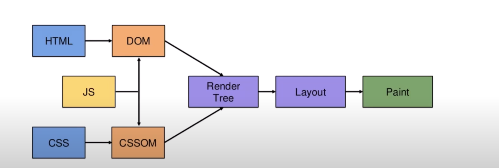

### 브라우저 렌더링 과정

#### 1. HTML → DOM (Document Object Model)

- HTML 문서를 파싱해서 브라우저가 이해할 수 있는 **트리 구조의 객체 모델(DOM)**을 생성

- 브라우저는 텍스트 파일인 HTML을 직접 화면에 표시할 수 없기 때문에,
  DOM이라는 **계층적 구조(Tree)**로 변환하여 각 노드(Element)를 조작할 수 있게 해야함

- HTML 파서(Parser)가 `<html>`, `<body>`, `
` 등을 만나면 각각 DOM 노드를 생성
- 이때 JS의 `document.querySelector` 등이 조작하는 대상이 바로 이 DOM Tree

#### 2. CSS → CSSOM (CSS Object Model)

- CSS 파일을 파싱해 **CSS 규칙들을 객체화한 트리 구조(CSSOM)**를 생성
- DOM은 “무엇이 있는지”를 표현하고, CSSOM은 “어떻게 보여야 하는지”를 표현
- 이 둘이 결합되어 최종적인 시각적 구조를 만들기 위해 필요
- 각 CSS 규칙을 구문 분석(Parser)해서 선택자(selector)와 속성(properties)을 트리 형태로 저장
- 이후 이 CSSOM이 DOM과 결합되어 Render Tree를 생성하는 데 사용

#### 3. JS (JavaScript) ↔ DOM / CSSOM

- 자바스크립트는 DOM과 CSSOM을 조작하거나 갱신할 수 있는 언어
- 동적 웹페이지를 만들기 위해선 JS가 DOM 노드나 스타일을 실시간으로 바꿔야 함
  예)
- `document.body.style.color = "red"`는 CSSOM에 영향
- `document.createElement("div")`는 DOM에 변화
- JS 실행 후 DOM/CSSOM이 변경되면 브라우저는 이후 Render Tree~Paint 단계를 다시 실행
  - 이것이 **Reflow/Repaint**의 원인

#### 4. DOM + CSSOM → Render Tree

- DOM과 CSSOM을 결합하여 보이는 요소만으로 구성된 Render Tree를 생성
- DOM에는 `<head>`나 `display:none` 같은 실제로 화면에 나타나지 않는 노드도 포함
- Render Tree는 실제 **시각적으로 렌더링되는 노드들만 포함한 트리**
- 각 노드의 스타일(색상, 폰트, 크기, 위치 등)을 계산
- 부모 자식 관계를 유지하면서 시각적 레이아웃의 기반을 생성

#### 5. Render Tree → Layout (Reflow)

- 화면에서 각 요소의 정확한 크기와 위치를 계산하는 단계
- 화면에 어떤 요소가 몇 px 크기로, 어느 좌표에 표시되어야 할지를 알아야 그릴 수 있음
- 각 노드의 **width, height, margin, padding, position** 등을 계산
- 부모 자식 간 레이아웃 관계를 모두 고려해 **픽셀 단위의 좌표**를 결정

#### 6. Layout → Paint

- Layout에서 계산된 위치, 색상, 그림자, 텍스트 등을 실제 화면 픽셀로 그리는 단계
- 브라우저는 GPU/CPU를 이용해 Layout 정보를 기반으로 렌더링(그리기) 작업을 수행해야 화면에 표시 가능
- 배경색, 테두리, 텍스트, 그림자 등 **각 레이어를 페인트**
- 이후 GPU가 합성(Compositing)을 수행해 최종 이미지를 디스플레이

### References

- [The Anatomy of Browser Rendering: How Web Pages Come to Life](https://medium.com/@regondaakhil/the-anatomy-of-browser-rendering-how-web-pages-come-to-life-6fa9e801a3f)
- [How Browser Rendering Works — Behind the Scenes](https://blog.logrocket.com/how-browser-rendering-works-behind-scenes/)
- [Understanding the Critical Path - web.dev](https://web.dev/learn/performance/understanding-the-critical-path)
